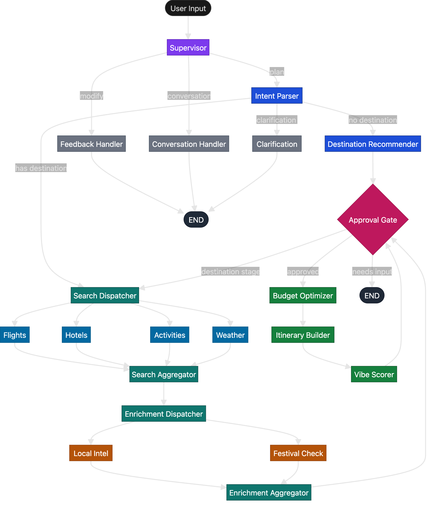

# TripSaathi — Har journey ka intelligent dost.

AI-powered travel planning across India with multi-agent workflows: flights, hotels, activities, weather, local secrets, and day-by-day itineraries.

## Features

- **Multi-agent planning**: Supervisor, intent parser, search agents (flight, hotel, activity, weather), enrichment (local intel, festivals), budget optimizer, itinerary builder, vibe scorer
- **Real + fallback data**: Amadeus (flights), LiteAPI (hotels), Google Places (activities), OpenWeatherMap; curated India cities/activities/festivals/tips when APIs are missing
- **Ground transport**: Train (IRCTC) and bus (RedBus, MakeMyTrip) URLs for budget trips
- **Sync LangGraph**: All orchestration is synchronous for Streamlit compatibility
- **SQLite**: Sessions, cache, and agent decisions persisted locally
- **Export & Share**: PDF, HTML, QR codes, shareable trip links

## Quick start

### Docker (recommended)

```bash
cd W2_Agentic_Workflow/app
cp .env.example .env        # fill in your keys (at minimum OPENAI_API_KEY)
docker compose up -d
```

**Access**: http://localhost:8501

For AWS EC2 deployment, see [Deployment Guide](../docs/DEPLOYMENT.md).

### Local

```bash
cd W2_Agentic_Workflow/app
python -m venv .venv
source .venv/bin/activate   # or .venv\Scripts\activate on Windows
pip install -r requirements.txt
streamlit run app/main.py
```

Open http://localhost:8501. Use the default query or type e.g. "Plan a 4-day solo backpacking trip to Rishikesh under ₹15,000".

## API keys (optional)

All keys are optional; the app degrades gracefully.

| Key | Purpose |
|-----|---------|
| `OPENAI_API_KEY` | Intent parsing, supervisor, optimization (GPT-4o / GPT-4o-mini) |
| `AMADEUS_CLIENT_ID` / `AMADEUS_CLIENT_SECRET` | Flight search (test API) |
| `LITEAPI_KEY` | Hotel search |
| `GOOGLE_PLACES_KEY` | Activities, opening hours, contact info |
| `GOOGLE_DIRECTIONS_KEY` | Travel times between stops (or reuse Places key) |
| `OPENWEATHERMAP_KEY` | Weather forecast |
| `REDDIT_CLIENT_ID` / `REDDIT_CLIENT_SECRET` | Local travel tips |

See `.env.example` for links to get each key.

## Agent flow



## Tech stack

- **Orchestration**: LangGraph (sync)
- **LLM**: OpenAI GPT-4o (intent, itinerary), GPT-4o-mini (supervisor, scoring)
- **UI**: Streamlit + custom CSS design system (Cormorant Garamond + Plus Jakarta Sans)
- **DB**: SQLite (sessions, cache, decisions)
- **Validation**: Pydantic v2
- **Deployment**: Docker (multi-stage build)

## Project structure

```
app/
  config.py, database.py, main.py
  api/          # Amadeus, LiteAPI, Google Places/Directions, Weather, Reddit, booking_links
  data/         # india_cities, india_festivals, india_activities, local_tips_db
  graph/        # state, supervisor, edges, builder, runner, nodes/
  memory/       # working_memory, conversation_memory, user_profile, context_compressor
  models/       # TripRequest, FlightOption, HotelOption, Activity, Trip, etc.
  prompts/      # supervisor, (intent_parser, budget_optimizer, etc.)
  ui/           # styles.py, components/ (onboarding, dashboard, itinerary, map, budget, tips, vibe, reasoning, chat, approval, share)
  export/       # PDF, JSON, HTML, QR, templates/
Dockerfile
docker-compose.yml
.env.example
requirements.txt
```
