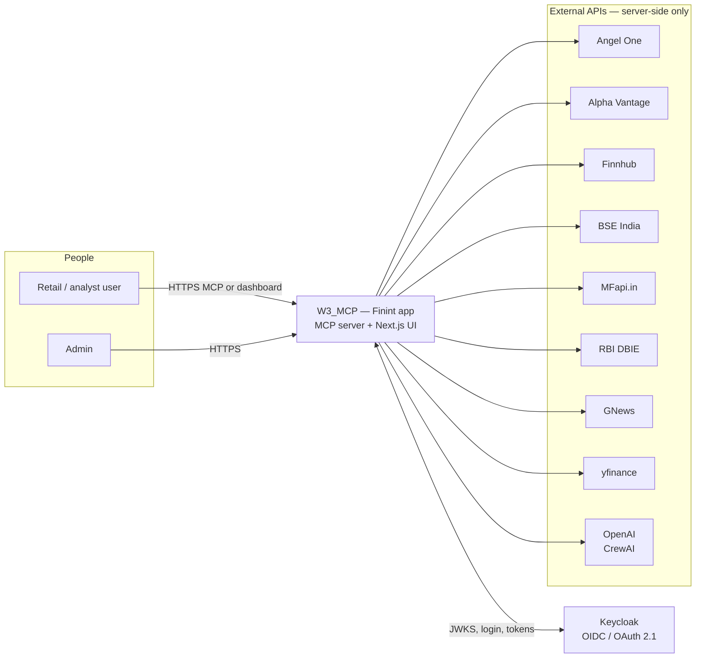
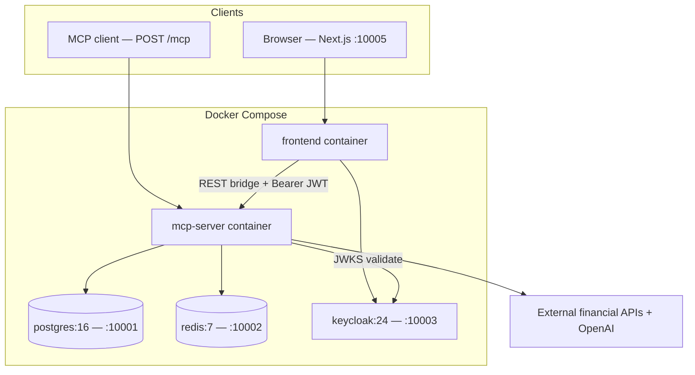
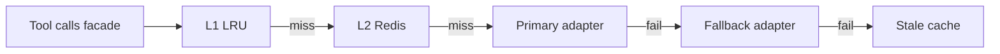
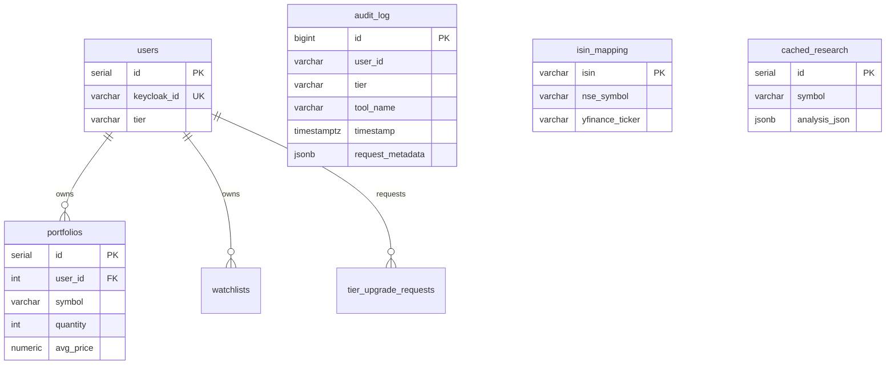
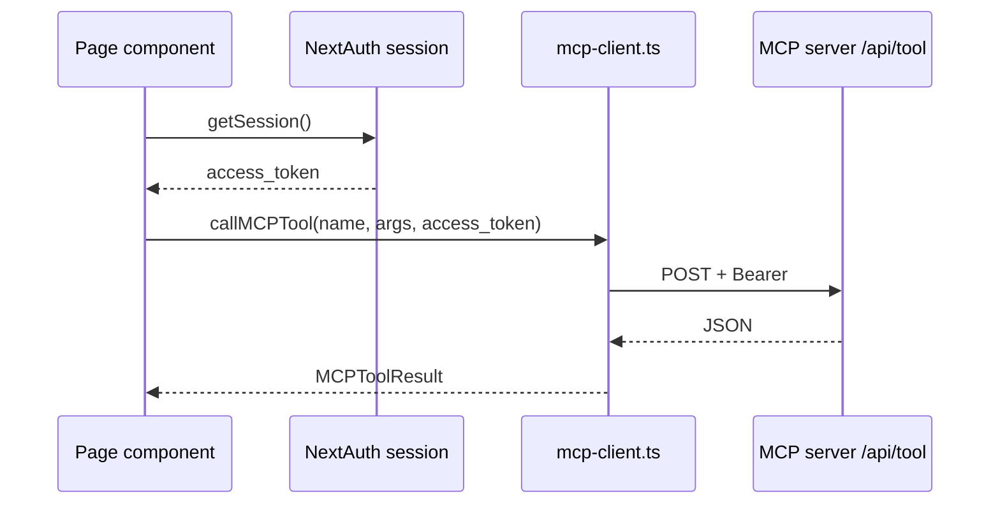
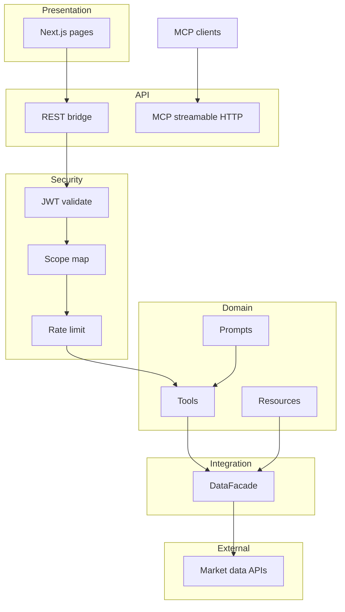
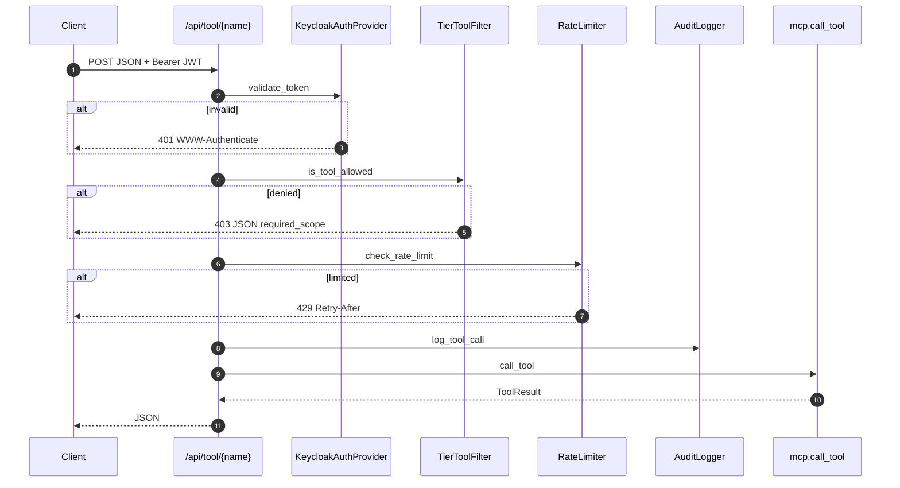

# W3_MCP — Detailed system architecture

This document is a **deep-dive** architecture reference for the **Indian Financial Intelligence** project: MCP resource server (Python / FastMCP), **Keycloak** (OAuth/OIDC), **Redis**, **PostgreSQL**, and **Next.js 14** dashboard. It complements `README.md` and `docs/architecture-doc.md` with **component-level detail**, **data flows**, **persistence**, and **honest boundaries** between what is fully enforced in code versus what is documented intent.

**Related:** Hackathon specification in `docs/AI League #3_ MCP.pdf` (traceability in [§17](#17-ai-league-3--requirements-traceability)).

---

## Table of contents

1. [Purpose and scope](#1-purpose-and-scope)
2. [System context (C4 Level 1)](#2-system-context-c4-level-1)
3. [Containers (C4 Level 2)](#3-containers-c4-level-2)
4. [MCP server components (C4 Level 3)](#4-mcp-server-components-c4-level-3)
5. [Runtime: ASGI app and routes](#5-runtime-asgi-app-and-routes)
6. [Authentication and authorization (detailed)](#6-authentication-and-authorization-detailed)
7. [Authorization enforcement surfaces](#7-authorization-enforcement-surfaces)
8. [Data aggregation facade](#8-data-aggregation-facade)
9. [External adapters](#9-external-adapters)
10. [Caching and resilience](#10-caching-and-resilience)
11. [Intelligence layer (CrewAI)](#11-intelligence-layer-crewai)
12. [Persistence and schema](#12-persistence-and-schema)
13. [Frontend architecture](#13-frontend-architecture)
14. [Network, CORS, and headers](#14-network-cors-and-headers)
15. [Observability](#15-observability)
16. [Project layout reference](#16-project-layout-reference)
17. [AI League #3 — requirements traceability](#17-ai-league-3--requirements-traceability)
18. [Summary](#18-summary)

---

## 1. Purpose and scope

### 1.1 Business goal

Unify **multiple Indian financial data sources** (equities, mutual funds, news, filings, macro) behind one **MCP** surface so AI clients can **discover** tools, resources, and prompts, while **tiered OAuth** controls cost, depth, and analyst-only **cross-source** reasoning.

### 1.2 Technical goal

- **Resource server pattern:** Keys and upstream quotas live **only** on the MCP server; browser clients never receive provider API keys.
- **Structured outputs:** Tools return **JSON** with `source`, `disclaimer`, and typed fields where possible (Pydantic models for crew outputs).
- **Operational shape:** **Docker Compose** runs database, cache, IdP, MCP server, and dashboard for a single-command demo.

### 1.3 Use cases implemented

The hackathon PDF asks each team to choose **one** of PS1–PS3. This repository implements **all three**:

| ID | Name | Primary modules |
|----|------|-----------------|
| PS1 | Research Copilot | `tools/market`, `fundamentals`, `news`, `macro`, `mutual_funds`, `filings`, `cross_source`, `crews/research_crew.py` |
| PS2 | Portfolio Risk Monitor | `tools/portfolio`, `crews/risk_crew.py`, portfolio resources |
| PS3 | Earnings Command Center | `tools/earnings`, `crews/earnings_crew.py`, earnings resources |

---

## 2. System context (C4 Level 1)

Actors and external systems at the boundary of the product (standard Mermaid for broad viewer support).



---

## 3. Containers (C4 Level 2)

Deployable units and their relationships (matches `docker-compose.yml`).



| Container | Responsibility |
|-----------|----------------|
| **frontend** | Next.js 14 UI (research / portfolio / earnings / settings / admin), NextAuth session, calls MCP via **REST bridge** |
| **mcp-server** | FastMCP + Starlette routes: `/mcp`, `/api/tool/*`, `/api/resource`, health, OAuth metadata, admin tier stubs |
| **postgres** | Portfolios, users mirror, audit log, ISIN map, macro cache table, research cache table, tier requests (schema) |
| **redis** | L2 cache for facade + sliding-window **per-user** rate limits |
| **keycloak** | Realm `finint`, clients, scopes, realm roles `free` / `premium` / `analyst` |

---

## 4. MCP server components (C4 Level 3)

Logical modules inside `mcp-server/src/`.

```mermaid
flowchart TB
  subgraph entry["Entry"]
    SRV[server.py — FastMCP + http_app]
  end

  subgraph api["HTTP surface"]
    MCPR[POST /mcp — Streamable MCP]
    REST[POST /api/tool/{name}]
    RES[GET /api/resource]
    META[GET /.well-known/oauth-protected-resource]
    HLTH[GET /health, GET /api/status]
    ADM[tier-request admin routes]
  end

  subgraph auth["auth/"]
    PRV[provider.py — JWKS JWT]
    MID[middleware.py — TOOL_SCOPE_MAP, TierToolFilter]
    RL[rate_limiter.py — Redis]
    AUD[audit.py — Postgres]
  end

  subgraph domain["Domain registration"]
    TTOOLS[tools/* — @mcp.tool]
    TRES[resources/resources.py — @mcp.resource]
    TPR[prompts/prompts.py — @mcp.prompt]
  end

  subgraph data["data_facade/"]
    FAC[facade.py — DataFacade]
    CAC[cache.py — dual_cache L1+L2]
    CB[circuit_breaker.py]
    ADP[adapters/*]
  end

  subgraph intel["crews/ + models/"]
    CR1[research_crew]
    CR2[risk_crew]
    CR3[earnings_crew]
    MOD[pydantic models]
  end

  SRV --> api
  SRV --> domain
  REST --> PRV
  REST --> MID
  REST --> RL
  REST --> AUD
  domain --> FAC
  CR1 & CR2 & CR3 --> FAC
  CR1 & CR2 & CR3 --> MOD
  FAC --> CAC
  FAC --> CB
  FAC --> ADP
```

---

## 5. Runtime: ASGI app and routes

- **Framework:** `FastMCP` builds a Starlette **ASGI** application via `mcp.http_app(path="/mcp", middleware=cors_middleware)` in `server.py`.
- **CORS:** `CORSMiddleware` allows all origins (`*`) for demo convenience; exposes `mcp-session-id` and allows `Authorization`, `mcp-protocol-version`, `mcp-session-id`.

### 5.1 Public routes (no JWT)

| Method | Path | Role |
|--------|------|------|
| GET | `/health` | Liveness / version |
| GET | `/api/status` | Which upstream env vars are set (“configured” vs not) |
| GET | `/.well-known/oauth-protected-resource` | RFC 9728 metadata |

### 5.2 Protected routes (JWT Bearer)

| Method | Path | Role |
|--------|------|------|
| POST | `/api/tool/{tool_name}` | **REST bridge:** validate JWT → scope → rate limit → audit → `mcp.call_tool` |
| GET | `/api/resource?uri=` | **REST bridge:** validate JWT → `mcp.read_resource` |
| POST | `/api/tier-request` | Optional body; attaches user from token if present |
| GET/POST | `/api/admin/tier-requests*` | Demo admin workflow (in-memory list in `server.py`; not wired to Postgres tier table in same process) |

### 5.3 Tool registration

`_register_tools()` imports every tool, resource, and prompt submodule so decorators run at import time:

- `tools.market`, `fundamentals`, `mutual_funds`, `news`, `macro`, `filings`, `portfolio`, `earnings`, `cross_source`
- `resources.resources`, `prompts.prompts`

---

## 6. Authentication and authorization (detailed)

### 6.1 Actors and tokens

1. User authenticates to **Keycloak** through the **Next.js** app (NextAuth OIDC with **PKCE**).
2. The dashboard obtains an **access token** (JWT) and passes it to the MCP server as `Authorization: Bearer <jwt>` on REST calls.
3. The MCP server **never** stores user passwords; it only validates JWTs.

### 6.2 JWT validation (`auth/provider.py`)

- **JWKS:** Keys fetched from Keycloak’s JWKS URI; cached (~1 hour) with refresh on `kid` mismatch.
- **Algorithms:** RS256.
- **Checks:** `issuer` = `settings.keycloak_issuer`, `audience` = `settings.keycloak_client_id`, expiry, signature.

### 6.3 Tier and scopes (important nuance)

After decoding the JWT, the server:

1. Reads `realm_access.roles`.
2. Picks the **highest** tier among `free`, `premium`, `analyst` via `_TIER_PRIORITY`.
3. Assigns **`scopes` from `TIER_SCOPES[tier]`** in `config/constants.py` — **not** from the JWT `scope` claim as the primary source of truth.

So authorization is **role → tier → full scope bundle**. This keeps Keycloak role setup simple and guarantees consistent tool gating as long as realm roles are correct.

### 6.4 Per-tool requirement (`auth/middleware.py`)

`TOOL_SCOPE_MAP` maps **each tool name** to exactly one **required scope** string (e.g. `get_stock_quote` → `market:read`, `earnings_verdict` → `research:generate`).

`TierToolFilter.is_tool_allowed(tool_name, claims)` returns whether `required_scope in claims.scopes`.

---

## 7. Authorization enforcement surfaces

Understanding **where** checks run is critical for security reviews.

| Surface | JWT | Scope check | Rate limit | Audit |
|---------|-----|-------------|------------|-------|
| `POST /api/tool/{name}` | Yes | Yes | Yes (Redis) | Yes (best-effort Postgres) |
| `GET /api/resource?uri=` | Yes | **Not** the same `TOOL_SCOPE_MAP` path — resource bridge validates token then reads resource | No explicit rate limit in same handler | No |
| `POST /mcp` (native MCP) | **Depends on FastMCP / client** — this repo does not wrap `/mcp` with the same Starlette JWT middleware as the REST bridge | TierToolFilter.**`filter_tools`** exists for MCP `tools/list` filtering but **is not invoked** from `server.py` today | Not on MCP path in `server.py` | Not on MCP path |

**Implication:** The **dashboard-driven demo** is strongly protected via the REST bridge. For **native MCP clients** talking to `POST /mcp`, you should confirm whether your deployment adds an auth wrapper or relies entirely on client-side discipline; tightening this would mean hooking JWT validation + `filter_tools` into the MCP session lifecycle.

---

## 8. Data aggregation facade

`DataFacade` (`data_facade/facade.py`) is the **single entry** for market price, fundamentals, news, MF, filings, macro, etc.

### 8.1 Resolution pipeline (conceptual)

For each logical data type the facade follows:

1. **L1 + L2 read** (`dual_cache.get`) — hit → return with `_cache: hit`.
2. **Miss → ordered source chain** (from `FALLBACK_CHAIN_*` constants), each call wrapped in a **circuit breaker**.
3. **Success → write-through** to L1/L2 with a **TTL** appropriate to the data type (± jitter in implementation).
4. **All sources fail → stale read** from cache if available.
5. Otherwise return a structured **error** payload for the tool layer to wrap.



### 8.2 ISIN / symbol normalization

`isin_mapper` bridges NSE symbols, ISIN, and provider-specific tickers so adapters receive consistent identifiers where possible.

---

## 9. External adapters

Each adapter encapsulates one provider’s wire format and error semantics.

| Adapter file | Role | Typical failure mode |
|--------------|------|----------------------|
| `angel_one.py` | Live quotes / session | Auth, session expiry |
| `alpha_vantage.py` | Fundamentals, technicals | Daily quota |
| `finnhub.py` | News, calendar | Per-minute quota |
| `gnews.py` | Backup news | Daily quota |
| `bse.py` | Filings / announcements | HTML / structure changes |
| `mfapi.py` | MF search, NAV | Network |
| `rbi_dbie.py` | Macro snapshot / series | Dataset refresh |
| `yfinance_adapter.py` | Broad fallback | Rate limits, unofficial API |

---

## 10. Caching and resilience

### 10.1 TTLs (from `config/constants.py`)

| Constant | Seconds | Intent |
|----------|---------|--------|
| `TTL_QUOTE_MARKET_HOURS` | 30 | Hot quotes during session |
| `TTL_QUOTE_AFTER_HOURS` | 43,200 | After hours |
| `TTL_FUNDAMENTALS` | 86,400 | Daily fundamentals |
| `TTL_NEWS` | 900 | ~15 min news |
| `TTL_MF_NAV` | 43,200 | NAV |
| `TTL_FILINGS` | 0 | Permanent / long-lived |
| `TTL_MACRO` | 604,800 | ~7 days macro |
| `TTL_TECHNICAL_INDICATORS` | 21,600 | Technicals |
| `TTL_SHAREHOLDING` | 604,800 | Shareholding |
| `TTL_EARNINGS` | 86,400 | Earnings-related |

`TTL_JITTER_PERCENT` reduces coordinated expiry.

### 10.2 Circuit breaker (`circuit_breaker.py`)

Parameters from `constants.py`: failure threshold, window, recovery timeout — per adapter name in `DataFacade._breakers`.

### 10.3 Rate limiting (`auth/rate_limiter.py`)

- **Per user id + tier:** sliding window in Redis (`TIER_RATE_LIMITS`: 30 / 150 / 500 per hour).
- **429 response** on REST bridge includes `Retry-After` header.

### 10.4 Upstream quota awareness

Rate limiter module also tracks **daily** style limits for selected upstreams (e.g. Alpha Vantage, GNews) to avoid burning keys — see `_UPSTREAM_DAILY_LIMITS` in `rate_limiter.py`.

---

## 11. Intelligence layer (CrewAI)

### 11.1 Role

**Cross-source** tools do not only concatenate API JSON; they run **CrewAI** “crews” of agents (collector / analyst / synthesizer pattern) backed by **OpenAI** models, with outputs validated or shaped via **Pydantic** models under `models/`.

### 11.2 Crews

| Module | Use case | Typical tools invoked |
|--------|----------|------------------------|
| `research_crew.py` | PS1 | Quote, fundamentals, news, macro, shareholding |
| `risk_crew.py` | PS2 | Portfolio summary, concentration, news, macro, MF overlap |
| `earnings_crew.py` | PS3 | Filings, EPS history, reaction, sentiment |

### 11.3 Output contract

Crew outputs feed tool responses that include:

- **Structured fields** (signals, scores, tables)
- **`citations`** or evidence strings
- **`contradictions`** where prompts require explicit disagreement handling
- **`disclaimer`** — not financial advice

### 11.4 Tracing

`tracing.py` initializes **LangSmith** / OpenTelemetry-style tracing when keys are configured (`init_tracing()` at server startup).

---

## 12. Persistence and schema

### 12.1 ER diagram (logical)



### 12.2 Table purposes

| Table | Used for |
|-------|----------|
| `users` | Local mirror / tier (registration flows may sync with Keycloak) |
| `portfolios` | PS2 holdings |
| `watchlists` | Optional watchlist persistence (schema present) |
| `audit_log` | Tool invocations for compliance / debugging |
| `isin_mapping` | Symbol normalization seed |
| `macro_data` | Optional stored macro series |
| `cached_research` | Server-side research cache |
| `tier_upgrade_requests` | Workflow DB (parallel to in-memory admin list in `server.py`) |

### 12.3 Code vs schema drift

- **MCP resources:** `resources.py` still uses **in-memory** `_watchlists` / `_research_cache` with a TODO to fully align with Postgres — schema already supports `watchlists` and `cached_research`.

---

## 13. Frontend architecture

### 13.1 Structure

- **App Router** pages: `research`, `portfolio`, `earnings`, `settings`, `admin`, `profile`, `signup`.
- **Auth:** NextAuth with Keycloak provider (`lib/auth.ts`).
- **MCP access:** `lib/mcp-client.ts` — **`callMCPTool` / `fetchMCPResource`** hit the **REST bridge** on `NEXT_PUBLIC_MCP_SERVER_URL` (default `http://localhost:10004`).
- **UX:** Tier-aware buttons map to tool names; 401/403/429 mapped to user-visible errors.



---

## 14. Network, CORS, and headers

- **Browser → MCP:** Allowed via CORS and `Authorization` header whitelist on the MCP ASGI app.
- **MCP session:** Clients may send `Mcp-Session-Id`; exposed in CORS for streamable HTTP semantics.
- **OAuth metadata:** `/.well-known/oauth-protected-resource` returns `resource`, `authorization_servers`, `scopes_supported` from `ALL_SCOPES`.

---

## 15. Observability

| Mechanism | Location |
|-----------|----------|
| Structured logs | `structlog` JSON logs in MCP server |
| Health | `/health` |
| Upstream config snapshot | `/api/status` |
| Audit trail | `audit_log` table |
| LLM trace | LangSmith when configured |

---

## 16. Project layout reference

```
W3_MCP/
├── mcp-server/src/
│   ├── server.py              # ASGI app, routes, tool imports
│   ├── auth/                  # JWT, scopes, rate limit, audit
│   ├── config/                # settings.py, constants.py
│   ├── data_facade/           # facade, cache, breakers, adapters
│   ├── tools/                 # Domain MCP tools
│   ├── resources/             # MCP resources
│   ├── prompts/               # MCP prompts
│   ├── crews/                 # CrewAI
│   └── models/                # Pydantic
├── frontend/                  # Next.js 14
├── keycloak/realm-export.json
├── db/init.sql
├── docker-compose.yml
└── docs/                      # PDF, MCP.md, architecture-doc.md
```

---

## 17. AI League #3 — requirements traceability

Cross-check against `docs/AI League #3_ MCP.pdf`: shared base, technical rules, PS1–PS3, deliverables.

### 17.1 Shared base — data sources

| PDF requirement | Status | Notes |
|-----------------|--------|--------|
| Integrate **≥4** APIs, **≥3** data types (market, text/news, macro or documents) | **Met** | Angel One, yfinance, MFapi.in, Alpha Vantage, Finnhub, GNews, BSE, RBI DBIE. |
| NSE India as example | **Partial** | **Angel One + yfinance** substitute for live/historical NSE-style data. |
| data.gov.in | **Gap** | Not used; RBI + others cover macro. |

### 17.2 Authentication and authorization

| PDF requirement | Status | Notes |
|-----------------|--------|--------|
| OAuth **2.1** + **PKCE** (public clients) | **Met** | NextAuth + Keycloak on dashboard; Bearer to MCP. |
| Protected Resource Metadata **RFC 9728** | **Met** | `GET /.well-known/oauth-protected-resource`. |
| Bearer validation: signature, expiry, audience | **Met** | `KeycloakAuthProvider` + JWKS. |
| **401** with discovery (`WWW-Authenticate` + resource metadata URL) | **Partial** | `WWW-Authenticate: Bearer realm="finint"`; no `resource_metadata` URL in header. |
| **403** `insufficient_scope` style | **Partial** | JSON `required_scope`; no `WWW-Authenticate` scope error on 403. |
| Three tiers + 30 / 150 / 500 / hour | **Met** | Redis sliding window + `Retry-After` on 429. |
| Auth server **separate** from MCP | **Met** | Keycloak container. |
| Upstream keys only on server | **Met** | `mcp-server` env / Docker secrets. |

### 17.3 Scopes

| Topic | Status | Notes |
|-------|--------|--------|
| `market:read` … `research:generate`, watchlist, portfolio | **Met** | `ALL_SCOPES` + Keycloak client scopes. |
| `macro:historical` for analyst macro depth | **Partial** | On analyst tier; **no tool** requires **only** this scope; macro tools use `macro:read`. |

### 17.4 Technical requirements (all use cases)

| PDF requirement | Status | Notes |
|-----------------|--------|--------|
| Streamable HTTP, remote deployment | **Met** | `POST /mcp`, Docker. |
| Capability negotiation, **tier-aware** discovery | **Partial** | Tier-aware **`filter_tools`** exists but is **not** invoked for native MCP (see [§7](#7-authorization-enforcement-surfaces)); REST bridge enforces per call. |
| Pagination (news, filings, history) | **Partial** | Some `days` / caps; not uniform `limit`/`offset`. |
| Resource subscriptions | **Gap** | Not implemented. |
| Structured errors | **Partial** | REST JSON errors; facade degrades gracefully. |
| Caching TTLs (~60s quotes, ~30m news, ~24h financials, permanent filings) | **Met** | Aligned in spirit (e.g. 30s quotes in session). |
| User store (watchlist, research) | **Partial** | Postgres schema exists; some resources still **in-memory** in `resources.py`. |
| Audit log | **Met** | `audit_log` + `AuditLogger`. |
| Citations, structured JSON, disclaimers | **Met** | Tool + crew outputs. |

### 17.5 Tier matrix deltas (PDF vs code)

| Issue | Detail |
|-------|--------|
| PS2 Free tier | PDF: only add/remove/summary on Free. Code: `portfolio_health_check` and `check_concentration_risk` use `watchlist:read`, which **Free** has → **more permissive** than PDF. |
| MF comparison | PDF: Premium+ for comparison depth. Code: `compare_funds` → `mf:read` → **Free** can call it. |

### 17.6 Use cases PS1–PS3

| Use case | Status |
|----------|--------|
| PS1 Research Copilot | **Met** — tools, resources, prompts, cross-source crew. |
| PS2 Portfolio Risk | **Partial** — tools + resources **Met**; **subscriptions** **Gap**; tier delta above. |
| PS3 Earnings | **Met** — calendar through verdict; LLM filing parse per PDF “shortcut” guidance. |

### 17.7 Deliverables

| Item | Status |
|------|--------|
| Working MCP + OAuth + tiers | **Met** |
| Docker Compose (MCP + auth + cache + DB + UI) | **Met** |
| README, `.env.example`, health / status | **Met** |
| Architecture diagram + explanation | **Met** — this document + `docs/architecture-doc.md` |
| Single full OpenAPI for every tool | **Partial** |

---

## 18. Summary

W3_MCP is a **layered financial MCP stack**: **Keycloak** for identity, **FastMCP** for protocol + **REST bridge** for the web UI, **Redis + in-memory** for cache and rate limits, **PostgreSQL** for portfolios and audit, **DataFacade** for multi-adapter resilience, and **CrewAI** for analyst-tier synthesis. The **most detailed** extension points for production hardening are: **unify auth on `/mcp` with REST parity**, **wire `filter_tools` into MCP sessions**, **implement resource subscriptions**, **align tier matrices with the PDF**, and **complete persistence** for resources that still use in-memory stores.

---

## Appendix A — Layer diagram (compact)



---

## Appendix B — Auth sequence (REST tool call)


