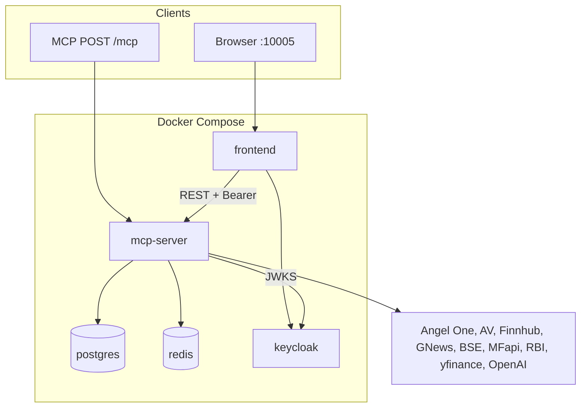
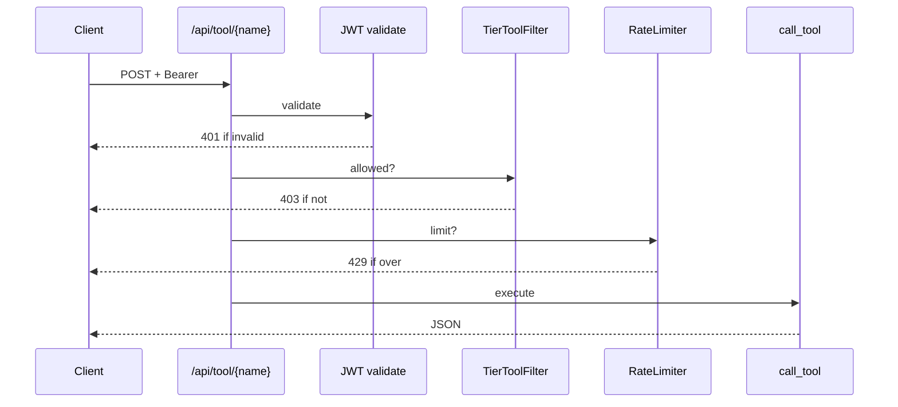

# Architecture — Indian Financial Intelligence (W3 MCP)

FastMCP server + Next.js UI + Keycloak + Postgres + Redis. Structured JSON tools, tiered OAuth, multi-source data via **DataFacade**, analyst synthesis via **CrewAI**.

| Doc | Role |
|-----|------|
| [DEPLOYMENT.md](DEPLOYMENT.md) | Runbooks |
| [MCP.md](MCP.md) | MCP primitives / protocol |
| [trust-score.md](trust-score.md) | **Special feature:** cross-source trust score, conflicts, evidence matrix |
| [task-breakdown.md](task-breakdown.md) | Build checklist |
| [AI League #3_ MCP.pdf](AI%20League%20%233_%20MCP.pdf) | Spec — traceability [below](#pdf-requirements-traceability) |

---

## Contents

[System & data flow](#system--data-flow) · [Routes](#routes) · [Auth & enforcement](#auth--enforcement) · [Data facade & adapters](#data-facade--adapters) · [Cache & limits](#cache--limits) · [CrewAI](#crewai) · [**Cross-source trust score (special feature)**](#cross-source-trust-score-special-feature) · [Persistence](#persistence) · [Frontend & observability](#frontend--observability) · [Repo layout](#repo-layout) · [PDF traceability](#pdf-requirements-traceability) · [Summary](#summary) · [Appendix: REST tool sequence](#appendix-rest-tool-call-sequence)

---

## Goals & scope

- **Product:** One MCP surface over Indian equities, MF, news, filings, macro; **Free / Premium / Analyst** tiers; cross-source reasoning on analyst tier. A **special differentiator** on analyst cross-source tools is the deterministic **trust score** layer (agreement, contradictions, missing signals)—see [Cross-source trust score](#cross-source-trust-score-special-feature).
- **Technical:** Upstream keys only on server; tools return JSON (`source`, disclaimers); **Docker Compose** for demo.
- **Use cases (PDF asks for one; repo implements all three):** PS1 Research (`cross_source`, `research_crew`) · PS2 Portfolio (`portfolio`, `risk_crew`) · PS3 Earnings (`earnings`, `earnings_crew`).

---

## System & data flow



| Unit | Role |
|------|------|
| **frontend** | Next.js, NextAuth → Keycloak; calls MCP **REST bridge** |
| **mcp-server** | FastMCP: `/mcp`, `/api/tool/*`, `/api/resource`, health, OAuth metadata |
| **postgres** | Portfolios, audit, ISIN map, caches, tier requests (schema) |
| **redis** | L2 cache + per-user rate windows |
| **keycloak** | Realm `finint`, roles `free` / `premium` / `analyst` |

**Internals (`mcp-server/src`):** `server.py` (ASGI, CORS, routes) → `auth/` (JWT, `TOOL_SCOPE_MAP`, rate limit, audit) → `tools/*`, `resources/`, `prompts/` → `data_facade/` (cache, breakers, `adapters/*`) → `crews/` + `models/`. Analyst cross-source responses are post-processed by **`cross_source/`** (trust envelope); see [below](#cross-source-trust-score-special-feature).

---

## Routes

| | Path | Auth |
|---|------|------|
| Public | `/health`, `/api/status`, `/.well-known/oauth-protected-resource` | — |
| Bridge | `POST /api/tool/{name}`, `GET /api/resource?uri=` | Bearer JWT |
| Other | `POST /api/tier-request`, admin tier routes | JWT (admin for `/api/admin/*`) |
| MCP | `POST /mcp` | See [enforcement table](#authorization-enforcement-surfaces) |

Tools load via `_register_tools()` importing `tools.*`, `resources.resources`, `prompts.prompts`.

---

## Auth & enforcement

- **Flow:** User → Keycloak (NextAuth + **PKCE**) → JWT on `Authorization: Bearer` to MCP REST calls.
- **JWT (`auth/provider.py`):** JWKS (cached), RS256, issuer, audience, `exp`.
- **Scopes:** From **`realm_access.roles` → highest tier → `TIER_SCOPES[tier]`** in `config/constants.py` (not the JWT `scope` string as primary).
- **Gating:** `TOOL_SCOPE_MAP` maps each tool → one required scope; `TierToolFilter.is_tool_allowed()`.

### Authorization enforcement surfaces

| Surface | JWT | Scope | Rate limit | Audit |
|---------|-----|-------|------------|-------|
| `POST /api/tool/{name}` | ✓ | ✓ | Redis | Postgres (best-effort) |
| `GET /api/resource?uri=` | ✓ | Not `TOOL_SCOPE_MAP` path | — | — |
| `POST /mcp` | **Not** same Starlette middleware as REST | `filter_tools` exists, **not wired** in `server.py` | — | — |

**Implication:** Dashboard/REST path is fully gated; native MCP clients need an explicit auth wrapper or client discipline until JWT + `filter_tools` are hooked into the MCP session.

---

## Data facade & adapters

**`DataFacade`:** L1+L2 read → on miss, **fallback chain** per data type (circuit breaker per adapter) → write-through with TTL → **stale** read if all fail → structured error.

**`isin_mapper`:** Symbol / ISIN / provider tickers.

| File | Role |
|------|------|
| `angel_one.py` | Quotes (session auth) |
| `alpha_vantage.py` | Fundamentals, technicals |
| `finnhub.py` | News, calendar |
| `gnews.py` | News backup |
| `bse.py` | Filings / announcements |
| `mfapi.py` | MF NAV, search |
| `rbi_dbie.py` | Macro |
| `yfinance_adapter.py` | Fallback |

---

## Cache & limits

**TTLs** (full constants in `config/constants.py`): quotes ~**30s** (session), **24h** fundamentals, **~15m** news, **7d** macro/shareholding, filings long-lived; **± jitter**.

**Circuit breaker:** Per adapter in `DataFacade._breakers` (thresholds in `constants.py`).

**User limits:** 30 / 150 / 500 calls/hour by tier, Redis sliding window, **429** + `Retry-After`. **Upstream daily** caps (e.g. Alpha Vantage, GNews): `rate_limiter.py` (`_UPSTREAM_DAILY_LIMITS`).

---

## CrewAI

Cross-source tools run **`research_crew`**, **`risk_crew`**, **`earnings_crew`** (sequential processes, OpenAI, Pydantic outputs: signals, citations, contradictions, disclaimer). **`tracing.py`** → LangSmith when configured.

---

## Cross-source trust score (special feature)

This is an **intentional product edge**, not generic API aggregation: selected analyst tools attach a **deterministic** (no LLM scoring) envelope so clients can show **confidence**, **signal agreement vs contradiction**, and **structured conflicts** across sources.

| | |
|--|--|
| **Spec / rationale** | [trust-score.md](trust-score.md) |
| **Code** | `mcp-server/src/cross_source/` — `signal_normalizer.py`, `conflict_detector.py`, `trust_scorer.py`; entry `compute_trust_envelope()` |
| **Merged into `data`** | `trust_score`, `signal_summary`, `conflicts`, `evidence_matrix`, `trust_score_reasoning` |
| **Tools** | `cross_reference_signals`, `generate_research_brief`, `earnings_verdict`, `portfolio_risk_report` |
| **UI** | `frontend/components/trust-score-panel.tsx` on Research, Earnings verdict, Portfolio risk report |

CrewAI may still produce narratives and signal rows; the trust layer **re-scores in pure Python** from normalized signals plus cross-topic rules (e.g. price vs sentiment, earnings vs price reaction). Heuristic fallbacks use the same path; portfolio heuristic supplies **synthetic signal rows** so the engine stays unified.

---

## Persistence

**Tables:** `users`, `portfolios`, `watchlists`, `audit_log`, `isin_mapping`, `macro_data`, `cached_research`, `tier_upgrade_requests`.

**Drift:** Some MCP resources still use **in-memory** watchlist/research in `resources.py`; Postgres schema exists for alignment.

---

## Frontend & observability

- **Next.js App Router:** `research`, `portfolio`, `earnings`, `settings`, `admin`, etc. **`lib/mcp-client.ts`** → REST bridge + Bearer from NextAuth session. Analyst views surface the **trust score panel** when tool `data` includes trust fields ([special feature](#cross-source-trust-score-special-feature)).
- **CORS:** Permissive (`*`) for demo; `Mcp-Session-Id` exposed.
- **Logs / health / audit / LLM:** `structlog`, `/health`, `/api/status`, `audit_log`, LangSmith.

---

## Repo layout

```
W3_MCP/
├── mcp-server/src/   server.py, auth/, config/, data_facade/, cross_source/, tools/, resources/, prompts/, crews/, models/
├── frontend/
├── keycloak/, db/, docker-compose.yml, .env.example
└── docs/             this file, DEPLOYMENT, MCP, task-breakdown, PDF
```

---

## PDF requirements traceability

Cross-check: `docs/AI League #3_ MCP.pdf`.

### Data & auth

| Topic | Status | Note |
|-------|--------|------|
| ≥4 APIs, ≥3 data types | Met | 8 adapters |
| NSE-style example | Partial | Angel One + yfinance |
| data.gov.in | Gap | — |
| OAuth 2.1 + PKCE | Met | NextAuth + Keycloak |
| RFC 9728 metadata | Met | `/.well-known/oauth-protected-resource` |
| JWT validate (sig, exp, aud) | Met | JWKS |
| 401/403 discovery headers | Partial | JSON 403; WWW-Authenticate incomplete vs spec text |
| Tiers 30/150/500 | Met | Redis |
| IdP separate from MCP | Met | |
| Keys server-side only | Met | |

### Technical & product

| Topic | Status | Note |
|-------|--------|------|
| Streamable HTTP + Docker | Met | |
| Tier-aware `tools/list` | Partial | `filter_tools` not on MCP path |
| Pagination | Partial | caps/`days`, not uniform offset |
| Resource subscriptions | Gap | PS2 bonus |
| Structured errors / facade degrade | Partial | |
| Cache policy | Met | ~30s quotes, etc. |
| User store for watchlist/research | Partial | in-memory + schema |
| Audit | Met | |
| Citations / JSON / disclaimers | Met | |
| `macro:historical` depth | Partial | scopes vs tools |
| PS1 | Met | |
| PS2 | Partial | no subscriptions; tier looser than PDF on some tools |
| PS3 | Met | |
| Deliverables (README, compose, diagrams) | Met | OpenAPI for all tools: Partial |

**PDF vs code (tiers):** Free tier may use `portfolio_health_check` / `check_concentration_risk` (PDF stricter). **`compare_funds`** → `mf:read` (PDF implies Premium+ for comparison depth).

---

## Summary

Stack: **Keycloak** + **FastMCP** (REST bridge + `/mcp`) + **Redis/Postgres** + **DataFacade** + **CrewAI** + **`cross_source` trust envelope** on analyst cross-source tools ([special feature](#cross-source-trust-score-special-feature)).

**Hardening:** JWT + `filter_tools` on **`/mcp`**; resource **subscriptions**; align tier matrix with PDF; persist resources; richer **401/403** headers; pagination.

---

## Appendix: REST tool call sequence


