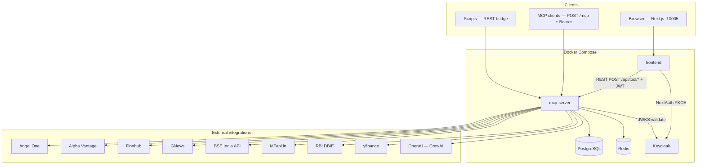
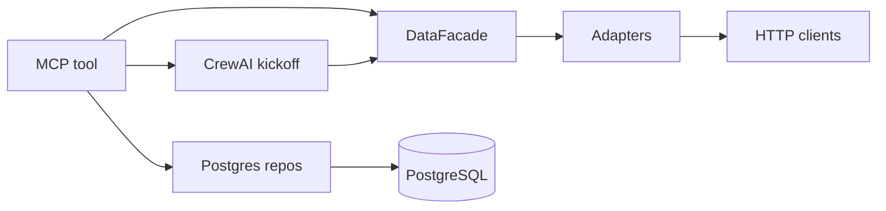
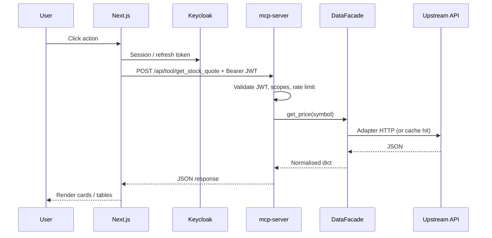
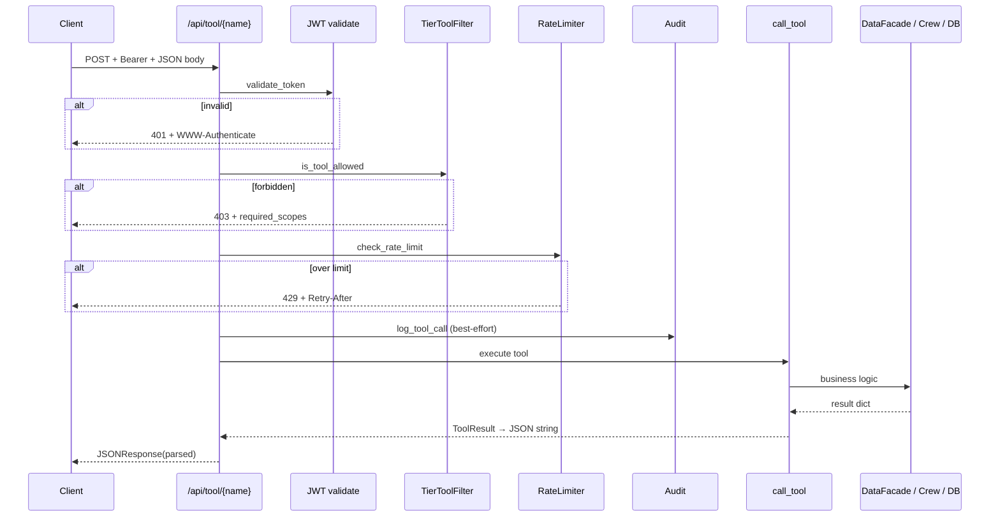

# Architecture — Indian Financial Intelligence (W3 MCP)

**Production-oriented system design** for the FinInt stack: Next.js dashboard, FastMCP server, Keycloak OAuth, PostgreSQL, Redis, multi-source **DataFacade**, **CrewAI** analyst crews, and deterministic **cross-source trust** scoring.

| Audience | Start here |
|----------|------------|
| New developers | [System architecture (deep dive)](#1-system-architecture-deep-dive) → [Tools architecture](#3-tools-architecture) → [Repo layout](#repo-layout) |
| QA engineers | [Testing & validation (QA perspective)](#7-testing--validation-qa-perspective) → [Sample execution report](#sample-execution-report) |
| AI/ML engineers | [CrewAI concepts](#2-crewai-concepts-detailed-explanation) → [LLM & prompt engineering](#6-llm--prompt-engineering) → [Observability](#8-observability--reporting) |
| System architects | [Communication flow](#4-communication-flow) → [API & data flow](#5-api--data-flow) → [Requirements traceability](#requirements-traceability) |

| Related doc | Role |
|-------------|------|
| [DEPLOYMENT.md](DEPLOYMENT.md) | Runbooks, EC2, ports, build args |
| [MCP.md](MCP.md) | MCP transport, IDE clients, curl — not full system design |
| [data-sources-guide.md](data-sources-guide.md) | Upstream APIs and keys |

---

## Table of contents

1. [System architecture (deep dive)](#1-system-architecture-deep-dive)  
2. [CrewAI concepts (detailed explanation)](#2-crewai-concepts-detailed-explanation)  
3. [Tools architecture](#3-tools-architecture)  
4. [Communication flow](#4-communication-flow)  
5. [API & data flow](#5-api--data-flow)  
6. [LLM & prompt engineering](#6-llm--prompt-engineering)  
7. [Testing & validation (QA perspective)](#7-testing--validation-qa-perspective)  
8. [Observability & reporting](#8-observability--reporting)  
9. [Cross-source trust score (product feature)](#9-cross-source-trust-score-product-feature)  
10. [Persistence](#persistence)  
11. [Requirements traceability](#requirements-traceability)  
12. [Appendices](#appendices)

---

## 1. System architecture (deep dive)

### 1.1 Logical architecture

The system is a **tiered BFF (backend-for-frontend)** pattern: the browser never holds upstream API keys. All market data, filings, and LLM calls flow through the **mcp-server**, which enforces **JWT**, **scopes derived from Keycloak realm roles**, **rate limits**, and **audit** (best-effort).



### 1.2 Layer responsibilities

| Layer | Responsibility | Primary code / assets |
|-------|----------------|------------------------|
| **Frontend** | Auth UX (NextAuth), tier-gated UI, calls REST bridge with session `accessToken`, renders trust panels | `frontend/app/*`, `lib/mcp-client.ts`, `components/trust-score-panel.tsx` |
| **Backend (MCP server)** | Tool registration, JWT validation, scope checks, rate limit, tool execution, JSON responses | `mcp-server/src/server.py`, `auth/*`, `tools/*` |
| **AI / agent layer** | Multi-agent CrewAI pipelines for research, risk, earnings; Pydantic outputs; optional LangSmith traces | `mcp-server/src/crews/*` |
| **Data layer** | Unified reads with cache, circuit breakers, fallback chains, stale fallback | `mcp-server/src/data_facade/*` |
| **Database** | Portfolios, alerts, notifications, research cache, audit (schema varies by feature) | `mcp-server/src/db/*`, `db/` init SQL |
| **External integrations** | Quotes, fundamentals, news, calendar, filings, macro, MF NAV | `data_facade/adapters/*` |

### 1.3 End-to-end request lifecycle (dashboard → tool → data)

1. **User** signs in via NextAuth → Keycloak (OAuth 2.1 + PKCE) → receives session with **access token** (JWT).
2. **Frontend** calls `POST /api/tool/{tool_name}` with `Authorization: Bearer <JWT>` and JSON body (e.g. `{ "symbol": "TCS" }`).
3. **REST bridge** (`server.py` → `rest_tool_bridge`):
   - Validates JWT via `KeycloakAuthProvider.validate_token()` (JWKS, `iss`, `aud`, `exp`).
   - Maps **realm roles** to **tier** → expands to **scopes** (`config/constants.py` → `TIER_SCOPES`).
   - Checks `TOOL_SCOPE_MAP` / `TierToolFilter.is_tool_allowed()`.
   - Applies Redis **rate limit** (tier buckets).
   - **Injects** `user_id` from claims for portfolio/alert tools.
   - Invokes `mcp.call_tool(name, body)`.
4. **Tool** (Python `@mcp.tool()` function) may:
   - Call `data_facade.get_*()` only, or
   - Call `run_*_crew()` (CrewAI), then post-process with `compute_trust_envelope()`, or
   - Read/write Postgres via `db/*_repo`.
5. **DataFacade** resolves symbol → adapter chain → cache write → returns dict (or error).
6. **Response** is JSON: typically `{ "data": {...}, "source": "...", "timestamp": "...", "disclaimer": "..." }` or top-level `error` for bridge-level failures.

### 1.4 Auth & enforcement

- **Flow:** User → Keycloak (NextAuth + **PKCE**) → JWT on `Authorization: Bearer` for MCP REST and `POST /mcp`.
- **JWT (`auth/provider.py`):** JWKS (cached), RS256, issuer, audience, `exp`. **`iss` must match** `settings.keycloak_issuer` (public URL); tokens minted against an internal hostname while the server expects the public issuer will fail validation.
- **Scopes:** From **`realm_access.roles` → highest tier → `TIER_SCOPES[tier]`** in `config/constants.py` (not the JWT `scope` string as primary).
- **Gating:** `TOOL_SCOPE_MAP` (`auth/middleware.py`) maps each tool → one required scope **or** a tuple of scopes (**all** must be present, e.g. `compare_funds` → `mf:read` + `fundamentals:read`). REST bridge uses `TierToolFilter.is_tool_allowed()` / `tool_scope_specs()`. Native **`POST /mcp`** uses **`KeycloakMCPVerifier`** and **`AuthMiddleware(auth=finint_component_auth)`** (`mcp_keycloak.py`), which filters **tools, prompts, and resources** by scope.

#### Authorization enforcement surfaces

| Surface | JWT | Scope | Rate limit | Audit |
|---------|-----|-------|------------|-------|
| `POST /api/tool/{name}` | ✓ | ✓ (`TOOL_SCOPE_MAP`, multi-scope AND) | Redis | Postgres (best-effort) |
| `GET /api/resource?uri=` | ✓ | Not `TOOL_SCOPE_MAP` (bridge does not re-check URI scopes) | — | — |
| `POST /mcp` | ✓ (`KeycloakMCPVerifier`) | ✓ (`AuthMiddleware` + `finint_component_auth`) | — | — |

**Note:** REST resource bridge still authenticates JWT only; **tier-aware resource access** is enforced on the native MCP path. Prefer **`GET /api/resource`** from the dashboard only for trusted UI paths, or extend the bridge with explicit URI→scope checks comparable to native MCP resources.

**Implication:** Dashboard REST and native MCP both require a **valid Bearer JWT**; **`tools/list`**, **prompts**, and **resources** on `/mcp` reflect the caller’s tier scopes (capability negotiation for clients).

#### Routes (quick reference)

| | Path | Auth |
|---|------|------|
| Public | `/health`, `/api/status`, `/.well-known/oauth-protected-resource` | — |
| Bridge | `POST /api/tool/{name}`, `GET /api/resource?uri=` | Bearer JWT |
| Other | `POST /api/tier-request`, admin tier routes | JWT (admin for `/api/admin/*`) |
| MCP | `POST /mcp` | See enforcement table above |

Tools load via `_register_tools()` importing `tools.*`, `resources.resources`, `prompts.prompts`. **Wiring MCP or curl:** [MCP.md](MCP.md).

#### Cache & limits (summary)

**TTLs** (full constants in `config/constants.py`): quotes ~**30s** (session), **24h** fundamentals, **~15m** news, **7d** macro/shareholding, filings long-lived; **± jitter**.

**Circuit breaker:** Per adapter in `DataFacade._breakers` (thresholds in `constants.py`).

**User limits:** 30 / 150 / 500 calls/hour by tier, Redis sliding window, **429** + `Retry-After`. **Upstream daily** caps (e.g. Alpha Vantage, GNews): `rate_limiter.py` (`_UPSTREAM_DAILY_LIMITS`).

---

## 2. CrewAI concepts (detailed explanation)

CrewAI is used for **analyst-tier** multi-step reasoning where a single LLM call would miss cross-source structure. The codebase uses **CrewAI 0.x** patterns: `Agent`, `Task`, `Crew`, `Process`, custom `BaseTool` subclasses, and **Pydantic** output models on the final task.

### 2.1 Agents

| Concept | What it is | Why used | Implementation |
|---------|------------|----------|------------------|
| **Agent** | A role-bound LLM worker with goal, backstory, optional tools | Specialise behaviour (data vs synthesis) and attach the right tools | `Agent(role=..., goal=..., backstory=..., llm=..., tools=[...], memory=True, ...)` in `crews/research_crew.py`, `risk_crew.py`, `earnings_crew.py` |

**Roles in this project:**

| Crew | Agents | Responsibility |
|------|--------|----------------|
| **Research** (`research_crew.py`) | Market Data Collector, Fundamental Analyst, News Sentiment Analyst, Macro & Risk Analyst, Research Synthesizer | Parallel fetch of price/shareholding, fundamentals, news, macro; sequential synthesis with citations |
| **Risk** (`risk_crew.py`) | Portfolio Scanner, Risk Detector, Macro Mapper, Risk Narrator | Parallel quote/sentiment/macro; portfolio risk narrative |
| **Earnings** (`earnings_crew.py`) | Filing fetcher, Price reaction, Parser, Verdict | Parallel filings + price + news; structured earnings verdict |

### 2.2 Tasks

| Concept | What it is | Why used | Implementation |
|---------|------------|----------|------------------|
| **Task** | A unit of work assigned to one agent with description + expected output | Decompose the problem; chain context into the final structured output | `Task(description=..., expected_output=..., agent=..., async_execution=True/False, context=[...], output_pydantic=...)` |

- **`async_execution=True`**: First wave tasks run **in parallel** (e.g. four research tasks), reducing wall-clock time.
- **`context=[...]`**: Final task receives outputs of prior tasks as input context.
- **`output_pydantic`**: Final task constrains output to a **Pydantic model** (e.g. `CrossSourceAnalysisOutput`, `PortfolioRiskReportOutput`, `EarningsVerdictOutput`).

### 2.3 Crew

| Concept | What it is | Why used | Implementation |
|---------|------------|----------|------------------|
| **Crew** | Orchestrates agents and tasks under a **process** | Single entry point `crew.kickoff()` | `Crew(agents=[...], tasks=[...], process=Process.sequential, memory=True, planning=True)` |

**Note:** `Process.sequential` is used at the **Crew** level; parallelism is achieved via **`Task.async_execution=True`** on the first wave. The planner still orders dependencies so the synthesis task runs after parallel tasks complete.

### 2.4 Tools (CrewAI tools vs MCP tools)

| Concept | What it is | Why used | Implementation |
|---------|------------|----------|------------------|
| **CrewAI `BaseTool`** | Sync `_run()` callable exposed to agents | LLM/tool runtime is sync/threaded; must bridge **async** `DataFacade` | Subclasses in `crews/*_crew.py` call `_run_async(data_facade.get_*(...))` and return **JSON strings** |

**Important distinction:**

- **MCP tools** (`@mcp.tool()` in `tools/*.py`) are the **public API** (REST + MCP protocol).
- **CrewAI tools** are **internal** helpers so agents can call the same data layer **without** duplicating HTTP.

### 2.5 Memory

| Concept | What it is | Why used | Implementation |
|---------|------------|----------|----------------|
| **Crew / agent memory** | CrewAI conversational / entity memory | Retain context across steps within a crew run | `memory=True` on agents and crew (CrewAI-managed) |

Long-term memory is **not** a separate vector DB in this repo; **caching** of crew outputs uses **PostgreSQL** (`research_cache_repo`) with TTL (e.g. 1h research, 30m risk).

### 2.6 Planning & execution flow

| Concept | What it is | Why used | Implementation |
|---------|------------|----------|----------------|
| **Planning** | CrewAI can plan task ordering / refinements | Improve multi-step quality | `planning=True` on `Crew` in research/risk/earnings builders |

**Execution path (example — research):**

1. `run_research_crew(symbol)` checks `OPENAI_API_KEY` and **Postgres cache**.
2. `asyncio.to_thread(crew.kickoff)` runs the crew off the async event loop.
3. Parallel tasks invoke **BaseTool** → `_run_async` → `DataFacade`.
4. Synthesizer task consumes context; **Pydantic** output parsed from `result.pydantic`.
5. Result cached; caller (e.g. `cross_reference_signals`) may attach **`compute_trust_envelope()`**.

### 2.7 Real execution example (trace)

**User action:** Analyst opens Research Copilot → Deep Dive → `cross_reference_signals` for `TCS`.

1. REST: `POST /api/tool/cross_reference_signals` + JWT with `analyst` role.
2. Tool in `tools/cross_source` (or equivalent) calls `run_research_crew("TCS")`.
3. **Agents 1–4** run tasks in parallel; each may call e.g. `StockQuoteTool._run("TCS")` → JSON string of `get_price` result.
4. **Synthesizer** produces `CrossSourceAnalysisOutput` (signals, citations, contradictions, synthesis).
5. **Trust layer** (`cross_source.compute_trust_envelope`) normalises signals and merges **deterministic** trust fields into the response payload for the UI.

---

## 3. Tools architecture

### 3.1 Structure

- **Pattern:** Module-level **`@mcp.tool()`** async functions (FastMCP), not classes per tool.
- **Location:** `mcp-server/src/tools/<domain>/tools.py` (market, fundamentals, news, portfolio, earnings, alerts, cross_source, etc.).
- **Registration:** Side-effect imports in `server._register_tools()`.

### 3.2 Input / output contracts

- **Input:** Declared as function parameters; FastMCP/Pydantic validates types. **Gap:** missing required args can surface as **500** on REST bridge if validation throws before a friendly handler.
- **Output:** Conventionally `{ "data": <serialisable dict>, "source": str, "timestamp": ISO8601, "disclaimer": str }`. Errors may appear as `data.error` from upstream or top-level `error` from bridge.

### 3.3 How tools reach APIs and databases



- **Market/fundamentals/news:** `data_facade.get_price|get_fundamentals|get_news|...`
- **Portfolio/alerts:** `portfolio_repo`, `alerts_repo` (asyncpg pool)
- **Analyst synthesis:** `run_*_crew` then optional `compute_trust_envelope`

### 3.4 Error handling, retry, fallback

| Mechanism | Where | Behaviour |
|-----------|-------|-----------|
| **Circuit breaker** | `data_facade/circuit_breaker.py` | Per-adapter failures open breaker; facade skips until recovery |
| **Fallback chain** | `DataFacade._fallback_chain` | Ordered list of sources per data type (e.g. news: Finnhub → GNews) |
| **Cache** | `dual_cache` (L1 memory + L2 Redis) | Reduce upstream load; **stale** read if all sources fail |
| **Crew fallback** | e.g. `earnings_verdict` | If crew fails, **heuristic** path still returns structured JSON + trust envelope |
| **Tool-level** | Individual adapters | `try/except` → `{ "error", "error_code", "_source" }` |

---

## 4. Communication flow

### 4.1 Sequence — REST tool (typical)



### 4.2 Sequence — analyst tool with CrewAI

Same as above until tool body:

1. Tool calls `run_research_crew(symbol)` (async → `to_thread(crew.kickoff)`).
2. Crew runs parallel tasks → tools → DataFacade → returns Pydantic dict.
3. Tool calls `compute_trust_envelope(signals, context="research")`.
4. Merged payload returned to client; **TrustScorePanel** reads `trust_score`, `conflicts`, etc.

### 4.3 Agent “decision” model

Agents do **not** call arbitrary code paths; they choose among **described tools** and **natural-language** planning steps. **Business rules** (tier gating, rate limits, trust scoring) live in **Python**, not in the LLM — this keeps compliance and determinism for the trust score.

---

## 5. API & data flow

### 5.1 Internal APIs (server)

| Path | Method | Auth | Purpose |
|------|--------|------|---------|
| `/health` | GET | No | Liveness |
| `/api/status` | GET | No | Upstream key/config hints |
| `/.well-known/oauth-protected-resource` | GET | No | RFC 9728 metadata |
| `/api/tools/catalog` | GET | No | Tool list + tier hints |
| `POST /api/tool/{name}` | POST | Bearer JWT | Primary dashboard integration |
| `GET /api/resource?uri=` | GET | Bearer JWT | MCP resource bridge (scope matrix lighter than native MCP) |
| `POST /mcp` | POST | Bearer JWT | Native MCP streamable HTTP |

### 5.2 External APIs (adapters)

Documented in [data-sources-guide.md](data-sources-guide.md). Summary:

- **Angel One** — quotes (primary when configured)  
- **yfinance** — quote/fundamentals/holders/options fallback  
- **Alpha Vantage** — fundamentals, technicals  
- **Finnhub** — news, earnings calendar  
- **GNews** — news fallback (Indian queries)  
- **BSE India** — filings, results, shareholding, board meetings (calendar enrichment)  
- **MFapi** — MF NAV/search  
- **RBI DBIE** — macro snapshot  
- **OpenAI** — CrewAI LLM backend  

### 5.3 Data transformations

- **Symbol normalisation:** `isin_mapper` + dynamic BSE scrip resolution for shareholding/filings.
- **News pipeline:** Finnhub empty → marked error → GNews; company name from mapper or yfinance `shortName` for query quality.
- **Trust post-processing:** Crew output signals → `signal_normalizer` / `conflict_detector` / `trust_scorer` → numeric `trust_score` and structured `conflicts`.

### 5.4 Error scenarios (client-visible)

| HTTP | Meaning |
|------|---------|
| 401 | Missing/invalid/expired JWT; `WWW-Authenticate` includes resource metadata URL |
| 403 | Tier lacks required scope(s); JSON includes `required_scopes` |
| 429 | Rate limit; `Retry-After` |
| 500 | Unhandled exception (e.g. tool argument validation) — **should be reduced** with explicit 400 mapping |

---

## 6. LLM & prompt engineering

### 6.1 Models

Configured in `config/settings.py` (env-overridable):

- **`openai_model_fast`** (default `gpt-4o-mini`) — data-collection agents, faster iterations.
- **`openai_model_reasoning`** (default `gpt-4o`) — fundamental/macro/synthesis agents.

**Why two tiers:** Cost/latency vs quality trade-off; parallel agents use the smaller model where tasks are tool-heavy and narrative-light.

### 6.2 Prompt design strategy

- **Backstories** embed **source-attribution rules** (e.g. “tag every ratio with [Source: Alpha Vantage]”).
- **Synthesis tasks** list **numbered rules**: citations, contradictions, no buy/sell advice, disclaimer.
- **Risk/Earnings crews** add **locale rules** (e.g. ₹ not $) where applicable.

### 6.3 Context handling

- Prior task outputs passed via **`context=[...]`** on the final task.
- **Token optimisation:** Parallelisation reduces repeated full-pipeline calls; **Postgres cache** avoids re-running crews for the same symbol/user window.

### 6.4 Guardrails

| Guardrail | Mechanism |
|-----------|-----------|
| **Hallucination / numeric drift** | Tools ground answers in JSON from DataFacade; Pydantic output schema on final task |
| **Investment advice** | Explicit “no buy/sell/hold” in synthesizer backstory |
| **Trust score** | **Deterministic** `compute_trust_envelope` — not LLM-scored |
| **Disclaimers** | Required strings in output models and tool responses |

---

## 7. Testing & validation (QA perspective)

### 7.1 Functional strategy

- **Tier matrix:** For each tool in `TOOL_SCOPE_MAP`, verify **403** for insufficient tier and **200** for allowed tier (use tokens whose `iss` matches `KEYCLOAK_PUBLIC_URL`).
- **Smoke:** `get_stock_quote`, `get_portfolio_summary`, `generate_morning_brief` with analyst user.
- **Regression suite:** Script `POST /api/tool/{name}` across all tools with representative payloads; assert HTTP 200 and required keys in `data`.

### 7.2 API validation

- Assert JSON shape: `data` object, `source`, `timestamp` where applicable.
- Cross-check **portfolio LTP** vs **get_stock_quote** for same symbols.
- Cross-check **macro** fields between `generate_morning_brief` and `check_macro_sensitivity`.

### 7.3 Edge cases & negatives

| Area | Cases |
|------|--------|
| Auth | Invalid token → 401; wrong tier → 403 |
| Input | Empty symbol, bogus symbol, SQL-like strings (should reject or safe error); **missing body fields** → should be **400** (verify bridge maps validation failures to 4xx) |
| Upstream | All adapters fail → facade returns error or stale cache |
| Time | Weekend/holiday → empty news/calendar; document as **data availability** not necessarily **bugs** |

### 7.4 Role-based validation

- Scopes derived from **realm roles** (`free`, `premium`, `analyst`, `admin`), not from fine-grained JWT `scope` string.
- **Multi-scope tools** (e.g. `compare_funds`) require **all** listed scopes.

### 7.5 Performance & stability

- Track p95 latency per tool; flag `generate_morning_brief`, `get_earnings_calendar` if > 5s without cold start.
- Bulk: rate limit should return 429, not hang.

---

## 8. Observability & reporting

### 8.1 Logging

- **structlog** JSON logs across server (`token_validated`, `facade.*`, `*.error`).
- Key events: auth success/failure, adapter errors, crew success/failure, cache hit/miss.

### 8.2 Monitoring

- **Docker healthchecks** → `GET /health`.
- **`/api/status`** — static “configured vs not” for upstream keys (not live ping of every API).

### 8.3 LLM traces

- **`tracing.py`**: When `LANGSMITH_TRACING=true` and API key set, OpenTelemetry + LangSmith processors instrument **CrewAI** and **OpenAI** (spans for agents/tools/LLM).

### Sample execution report

| Tool | HTTP | Time | Sample outcome |
|------|------|------|----------------|
| `get_stock_quote` | 200 | ~0.1s | `ltp`, `change_pct`, `volume` |
| `get_key_ratios` | 200 | ~0.1s | Ratios + optional `notes` |
| `generate_morning_brief` | 200 | ~1–3s | `greeting`, `portfolio`, `macro`, `summary` |
| `get_earnings_calendar` | 200 | ~1–2s | `entries`, `total_count`; India filter may be 0 if BSE upstream empty |

### Tool usage logs (what to grep)

- `token_validated` — user/tier per request  
- `rest_bridge.forbidden` — tier denials  
- `research_crew.cache_hit` / `risk_crew.cache_hit` — cache effectiveness  
- `facade.serving_stale` — degraded mode  

### Agent decision trace

- **LangSmith** (when enabled): trace shows agent steps, tool calls, and LLM generations for each crew run.

---

## 9. Cross-source trust score (product feature)

Deterministic post-processing in `cross_source/` — **not** LLM-scored. Normalises signals, detects conflicts, emits `trust_score`, `signal_summary`, `conflicts`, `evidence_matrix`, `trust_score_reasoning`. Used by analyst tools and **`TrustScorePanel`** in the UI. Heuristic fallbacks attach **synthetic signals** so the same engine runs when CrewAI is skipped.

---

## Persistence

| Store | Usage |
|-------|--------|
| **PostgreSQL** | Portfolios, alerts, notifications, research result cache, audit, optional ISIN mappings |
| **Redis** | L2 cache + rate-limit windows |

**Drift note:** Some MCP **resources** may still use in-memory structures; Postgres is the source of truth for portfolio/alerts in production paths.

---

## Requirements traceability

(See original checklist — still valid.)

| Topic | Status | Note |
|-------|--------|------|
| OAuth 2.1 + PKCE, JWT, tiers, rate limits | Met | |
| ≥4 external APIs / facade | Met | 8+ adapters |
| CrewAI + trust envelope | Met | Analyst paths |
| Resource subscriptions | Partial | Push subscriptions not fully productised; polling supported |
| Uniform pagination | Partial | Some tools differ on `page` / `page_size` / totals |

---

## Appendices

### Appendix A — REST tool call sequence (detailed)



### Appendix B — `TOOL_SCOPE_MAP` reference

Authoritative map: `mcp-server/src/auth/middleware.py` — each tool name maps to one scope or a **tuple** (AND). REST and MCP paths both depend on tier-derived scope lists from `TIER_SCOPES`.

### Appendix C — Repo layout

```
W3_MCP/
├── mcp-server/src/
│   ├── server.py              # ASGI, REST bridge, tool registration
│   ├── auth/                  # JWT, tier filter, MCP verifier
│   ├── config/                # settings, constants, TTLs
│   ├── data_facade/           # facade, cache, breakers, adapters, isin_mapper
│   ├── cross_source/          # trust envelope (deterministic)
│   ├── crews/                 # research_crew, risk_crew, earnings_crew
│   ├── tools/                 # MCP tools by domain
│   ├── db/                    # asyncpg repos
│   ├── resources/, prompts/
│   └── tracing.py
├── frontend/
├── keycloak/
├── db/
└── docs/
```

---

## Summary

**FinInt** is a **tiered, OAuth-secured MCP server** with a **DataFacade** for resilient multi-source market data, **CrewAI** for structured analyst narratives, and a **deterministic trust layer** for cross-source confidence. The **Next.js** app uses the **REST tool bridge** for all privileged calls.

---

*Document version: 2.1 — expanded for developers, QA, ML, and architects.*
